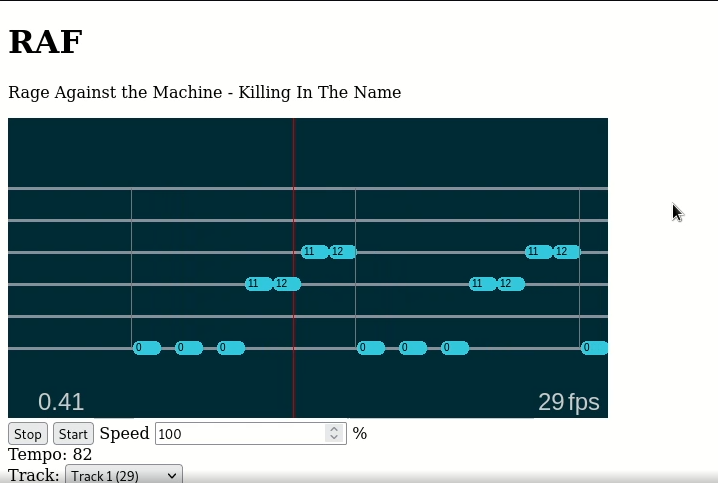
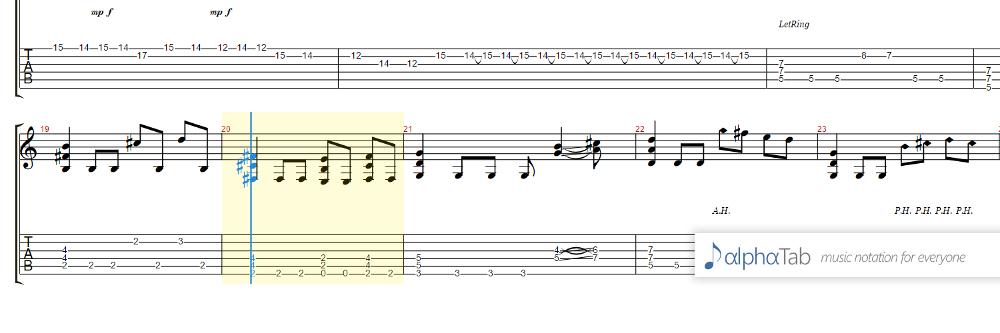
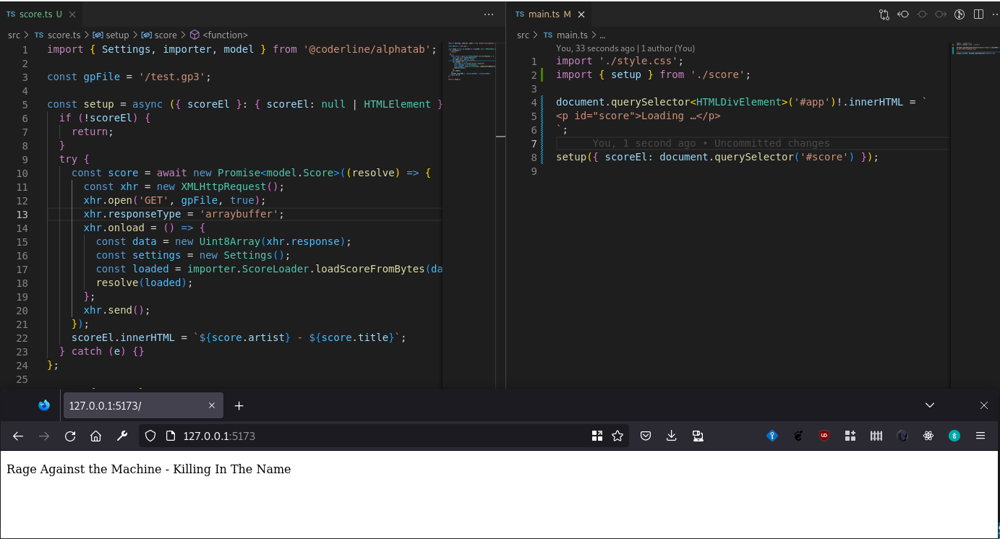

import ReactPlayer from 'react-player';
import pocAnimatedUrl from './poc-animated.mp4';
import previewUrl from './preview.mp4';

Suite à une discussion avec un ami, je me suis lancé un petit défi. Il existe
tout un tas de logiciels pour apprendre la musique et en particulier la guitare,
je pense à ultimate-guitare, yousician, tomplay, sonsterr…. Mais très peu sont
opensource (coucou [tuxguitar](https://www.tuxguitar.app/)) et encore moins sont
ceux qui poussent l'affichage en tablature dynamique.

Alors j'ai tenté de voir ce que j'étais en mesure de réaliser.

L'idée c'est de partir d'un fichier guitar-pro (.gp) qui contient déjà toutes
les informations nécessaires pour afficher les éléments à l'écran…

<!-- truncate -->

En faisant quelques recherches je tombe sur cet incroyable librairie qui permet
de lire les fichiers guitar-pro:
[AlphaTab - music notation and guitar tablature rendering librarie](https://github.com/coderline/alphaTab).
Le site internet permet de voir ce qu'il est possible de faire avec
[www.alphatab.net](https://www.alphatab.net/). Et c'est fou, on a la tablature,
la partition et la possibilité de lire le contenu en midi le tout de manière
programmatique.

En gros il n'y a plus qu'à mettre un peu de glue et ça semble être un peu trop
facile:

Après quoi ça devient enfin un peu compliqué, tout bouge, ça fait de la musique
mais il me reste à synchroniser le visuel sur le son.

<ReactPlayer
  controls
  url={pocAnimatedUrl}
  title="Vidéo montrant le test faisabilité de l'application, on voit le titre de la chanson, Killing In The Name de Rage against the machine ainsi qu'une tablature dynamique, des rectangles numérotés indiques sur quelles frettes de la guitare on doit appuyer et une ligne rouge verticale au milieu de l'écran indique quand on doit appuyer. Il n'y pas de son."
/>

J'arrive presque au bout de mon expérimentation, le plus difficile c'est donc de
synchroniser la musique avec l'affichage de la tablature. C'est très proche du
**développement de jeu vidéo** et c'est vraiment un monde à part.

<ReactPlayer
  controls
  url={previewUrl}
  title="Vidéo similaire à la précédente mais avec le morceau de musique joué en midi, la longueur des rectangles numérotés indique le temps que dure chaque note. On peut voir en bas à gauche la durée écoulée et à droite le nombre de FPS qui varie entre 19 et 60."
/>

> hmm …

Ok, c'est moche, ça saccade mais je vais vous expliquer pourquoi (ce n'est pas
un bug, c'est une feature comme toujours 😏).

Ce n'est pas mon métier, ne me jugez pas. Voilà ce que j'ai appris.

Je lis un fichier qui est capable d'être transcrit en midi et les temps sont
indiqués en «ticks», mais l'affichage lui ne connaît que les FPS (frame per
second).

Il faut donc trouver un terrain d'entente: _le temps_. Heureusement la formule
est assez simple pour le midi: `ms = 60000 / (BPM \* PPQ)`

Plus de détails dans cette réponse stackoverflow,
[convertir les ticks midi en temps (en)](https://stackoverflow.com/questions/2038313/converting-midi-ticks-to-actual-playback-seconds).

En fonction de la durée d'une mesure et une fois que l'on a déterminé la taille
que l'on veut lui donner à l'écran cela permet de calculer une vélocité. Disons
que nos mesures bougent à 76.56px par secondes (vous sentez venir la blague?).

Ensuite il ne reste qu'à déplacer l’élément de la distance voulue à chaque
frame, disons de 1.276px à 60 FPS. Sauf qu'un ordi ne tournera pas forcément à
60FPS. Mais ouf, on va lui appliquer un delta.

Ce n'est pas terminé (j'en viens à la blague), il n'est pas possible d'avancer
d'un demi pixel! Il arrive donc des désynchro qu'il faut corriger. Je l'ai fait
grossièrement sur le PoC, donc c'est moche, on a l'impression que ça saute.

Heureusement, tout ceci est très bien expliqué sur cet article
[game loops and timing](http://isaacsukin.com/news/2015/01/detailed-explanation-javascript-game-loops-and-timing)
basé certes sur javascript mais j'imagine que les concepts restent les mêmes
dans d'autres langages.

Le code source de petit projet est disponible sur github,
[RAF - une application pour apprendre à jouer d'un instrument de musique](https://github.com/iamdey/raf).
Pour l'instant des contraintes techniques ne permettent pas de déployer
l'application mais fonctionne correctement en environnement de développement.
