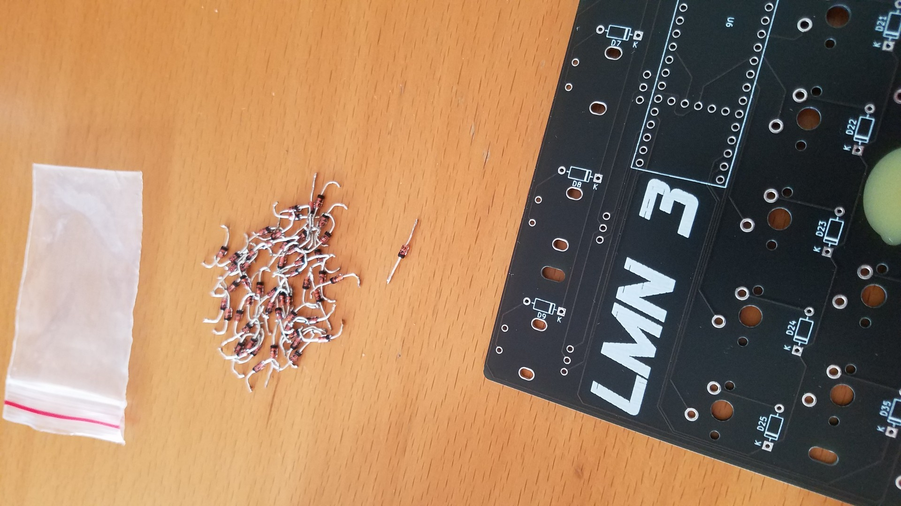
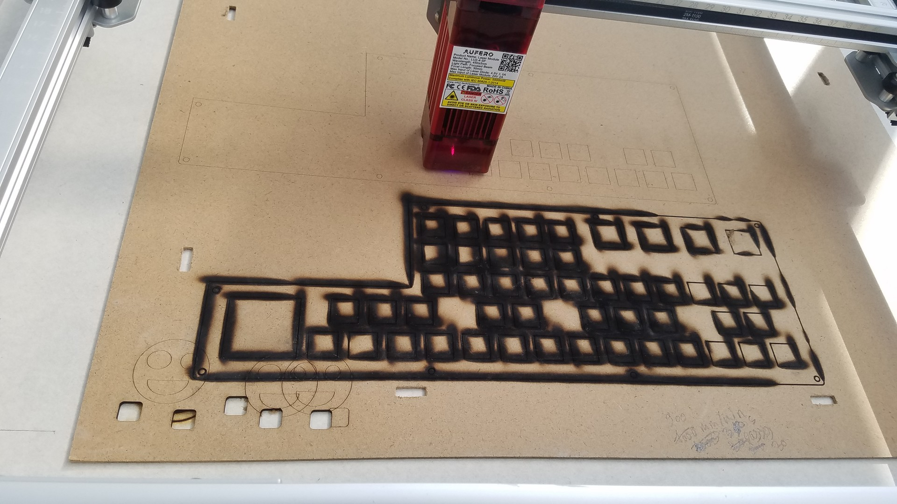
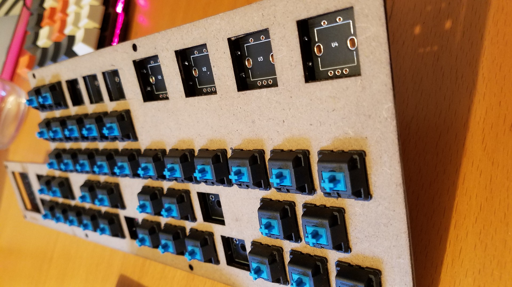
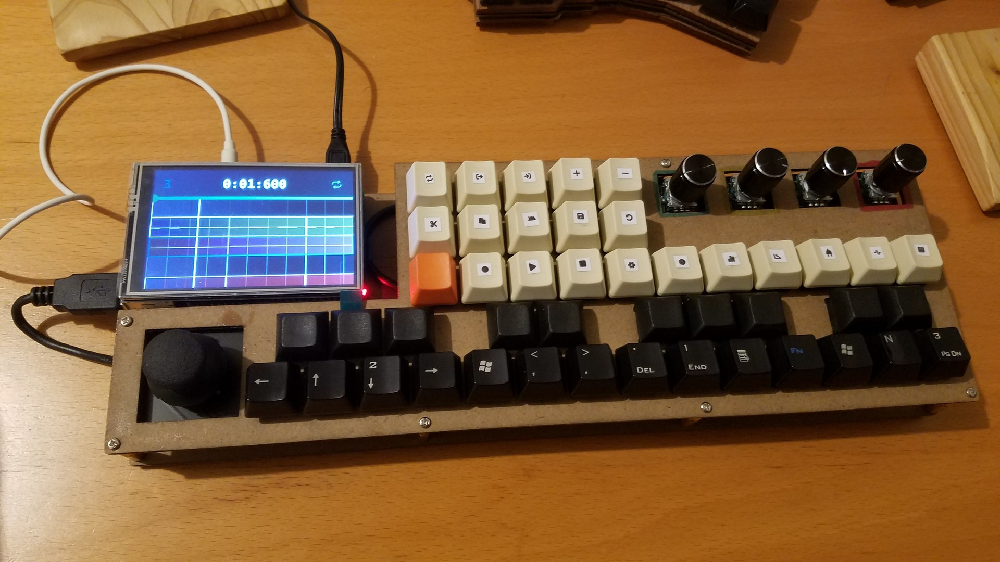

import ReactPlayer from 'react-player';
import videoUrl from './lmn-3.webm';

C'est un projet que j'ai vu passé il y a un bon moment et qui m'a beaucoup
emballé. LMN-3 est un «DAW in box» (Digital Audio Workstation) c'est à dire «une
station de travail audio numérique tout en un», c'est opensource et (presque)
openhardware. C'est basé sur un rasberry-pi pour le logiciel et un teensy pour
le controleur MIDI. Toutes les infos sont là
https://github.com/FundamentalFrequency#lmn-3

(Ok la musique est pas folle hein, c'est juste un exemple)

<ReactPlayer
  controls
  url={videoUrl}
  title="Vidéo de musique électronique créé à partir du LMN-3. On voit que
la musique est généré et contrôlé par un clavier spécifique que j'ai fabriqué."
/>

Pour ce projet qui est relativement #lowtech, j'ai essayé autant que possible de
réutiliser d'anciens composants notamment un vieux clavier mécanique…

<!-- truncate -->

Un clavier que m'a donné
[@gilles](https://mastodon.xyz/@gilles@social.poolp.org) (tu as vu, il a une
chouette nouvelle vie ;) ) J'ai donc démonté et dessoudé tous les switchs ainsi
que les diodes. C'est beaucoup de taff mais ça évite de jeter du matos et c'est
déjà bien.

Pour le teensy et le rasberry c'est plus compliqué avec la rupture
d'approvisionnement en électronique. J'ai attendu que les prix redescendent un
peu pour me jeter sur le teensy, par contre le raspberry c'est mort; les prix
étaient exorbitants même d'occasion. Heureusement, j'avais un raspberry-pi 2,
pas très puissant mais suffisant bien que le projet se base sur un
raspberry-pi 4.

Avant de me lancer j'ai pu tester le logiciel sur le raspberry avec l'émulateur
du contrôleur (et c'est trop cool!)
https://github.com/FundamentalFrequency/LMN-3-Emulator ça a l'air de
fonctionner, let's go.

Pour pouvoir démonter facilement le teensy (et éventuellement le réutiliser pour
d'autres projets), je l'ai soudé sur des broches. J'ai déjà eu la mauvaise
expérience de devoir remplacer un arduino, c'est très ennuyant à changer et vu
le prix du teensy, je préfère perdre en hauteur pour le boîtier.

La PCB, j'ai eu la chance de tomber sur un francophone qui en a fait faire. Je
devais encore trouver quelques composants comme les rotary encoders et l'écran,
pas le choix mais j'ai la chance d'avoir un des rares magasins d’électronique
ayant pignon sur rue ici.

Il ne me reste le boîtier que j'ai réalisé avec la découpeuse laser d'un pote en
utilisant une plaque de MDF (fond de placard ikea ou un truc du genre) je
pensais le faire avec du contre plaqué à la base comme pour mon clavier mais je
l'ai cramé avant de savoir comment fonctionnait la découpeuse. Le bois c'est
quand même plus chouette que le plastique d'une imprimante 3D.

Pour finir, le truc vraiment chouette avec ce projet, mais c'est aussi un
inconvénient, c'est que le logiciel au cœur du projet tourne sur raspbian
https://www.raspbian.org (qui est très long à démarrer). Le contrôleur midi est
un simple clavier qui se branche en usb, ce qui signifie que le contrôleur LMN-3
peut être utilisé sur n'importe quel OS tant qu'il peut être compilé.

Potentiellement il pourrait tourner sur android ce qui permettrait d'éviter
d'utiliser le raspberry + écran qui ne sont pas hyper optimisé. L'autre
conclusion, c'est que le contrôleur midi doit pouvoir être utilisé pour autre
chose que le LMN-3.

Page du projet initialement publié sur
https://hackaday.com/2022/06/14/lmn-3-putting-the-op-in-open-source-synthesizers/
