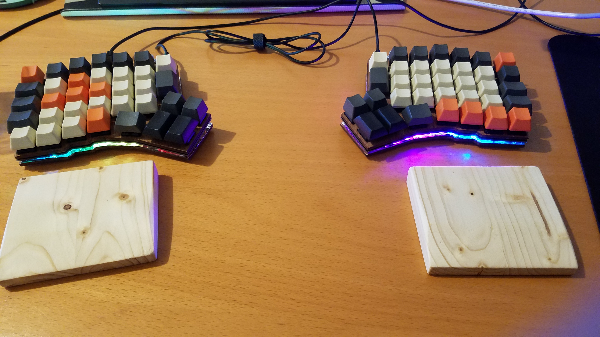

Je vous présente aujourd'hui
[Redox keyboard](https://hackaday.io/project/160610-redox-keyboard) le clavier
que j'utilise tous les jours depuis 2020.

Il s'agit d'un clavier mécanique très inspiré par
[ergodox](https://www.ergodox.io/).

<!-- truncate -->

C'est de mes premiers projets d'électronique d'envergure, (le coût et l'objectif
en font plus qu'un jouet que l'on abandonne au bout de 2 heures). La plupart des
pièces viennent de [falbatech](https://falbatech.click/). J'ai pu ainsi
sélectionner les switchs, des cherry MX silent et les caps.

Ma compagne ayant accès à ce moment à un fablab, elle a pu grâce à une
découpeuse laser produire le boitier à partir de contre plaqué de 3mm.

Il ne me restait plus qu'à souder les différents éléments, les diodes, les
switches et les 2 arduinos à la PCB.

Pour finir, il est nécessaire d'installer le firmware sur les 2 arduinos. Redox
utilise le framework [QMK Firmware](https://qmk.fm/). Il propose une
configuration par défaut en
[qwerty](https://github.com/qmk/qmk_firmware/tree/master/keyboards/redox) mais
avec quelques bidouillages, il devient une bonne base pour configuration en
[Bépo](https://bepo.fr/wiki/Accueil). Il fonctionne très bien autant sur
GNU/Linux que sur Windows (une fois
[le pilote installé](https://bepo.fr/wiki/Windows)).

J'ai tout de même fait une erreur pendant l'assemblage, la fiche USB sur les
arduinos est très fragile. N'ayant pas utilisé le boitier imprimé en 3D, ni le
boitier en bambou usiné par falbatech, il n'y avait pas de garde fou. À force de
bouger le clavier pour le nettoyer (c'est à dire tapoter dessus pour faire
tomber la poussière), j'ai arraché la prise. J'ai donc dû dessouder et remplacer
un des deux arduinos (le principal), c'était un peu moche comme opération mais
ça m'a montré à quel point j'en suis accroc.

À ce jour cela fait 3 ans que je l'utilise autant pour travailler que pour pour
jouer. Les switchs MX silent sont comme prévu très agréables et silencieux.
Certes le temps d'apprentissage peu rebuter mais la disposition bépo est juste
génial, je ne regarde plus mon clavier. Au début j'utilisais des stickers sur
les touches mais très vite je m'en suis passé. C'est comme une manette de jeu
vidéo, une fois apprise, on ne la regarde plus quand on joue. Seul «défaut», ce
n'est pas fait pour tapper à une main. Pour ce qui est de l'ergonomie, c'est
difficile à dire, est-ce que j'aurai plus ou moins de tendinite que mes paires à
moyen et long terme ? Il faudrait, pour le vérifier faire de vraies
statistiques.

En tout cas à l'heure actuelle je ne peux honnêtement plus m'en passer.
