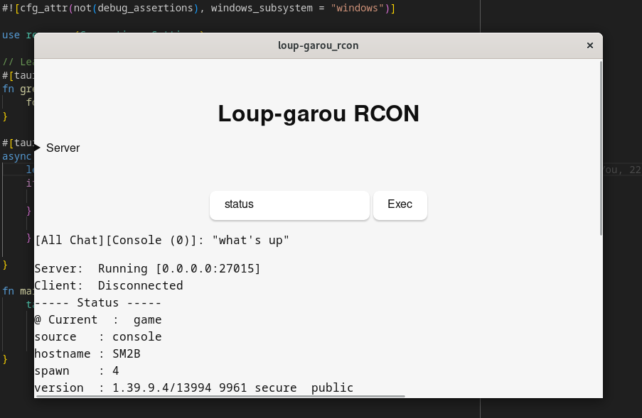
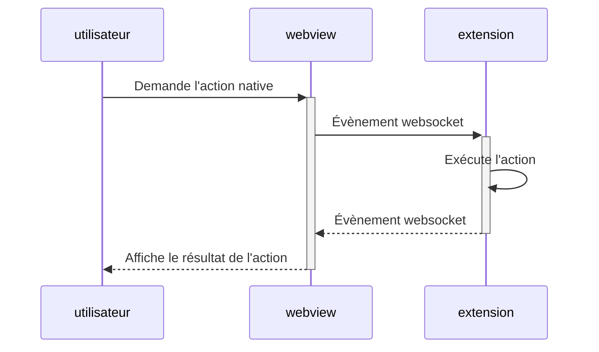
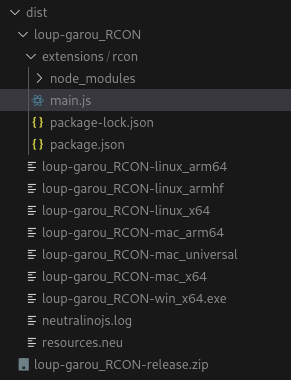

Il y a
[quelques temps je me suis mis sur un nouveau «side-project»](https://mastodon.xyz/@dey/111962553183051811),
une application qui permet de controller un serveur de jeu de valve.

Pour des besoins personnels, j'ai cherché en vain des applications graphiques
qui permettent de gérer un serveur de jeu dédié. J'ai trouvé quelques solutions
mais rien qui ne me satisfaisait vraiment (éditeur de confiance ou opensource ou
fonctionnant sur linux). Je me suis donc mis en tête de faire ma propre
application que je pourrai partager avec certaines personnes qui auraient besoin
de gérer ce serveur.

Les specs du <abbr title=" Minimum Viable Product">MVP</abbr> sont simples:

> Réaliser une application native cross-plateforme (Windows & Linux) permettant
> d’exécuter des commandes rcon et de voir le résultat.



Ça n'a pas été simple (et la raison est un peu surprenante)…

<!-- truncate -->

## Logique métier

Pour commencer, qu'est-ce que ce serveur de jeu? Il s'agit d'un
[«Source Dedicated Server» (SRCDS)](https://developer.valvesoftware.com/wiki/Source_Dedicated_Server),
c'est à dire le jeu (Half-Life, Dota, Counter-Strike…) sans la partie cliente et
permet donc de jouer à plusieurs, «en réseau». Celui-ci et cross-plateforme,
fonctionne sur Windows, Linux & MacOS et n'a pas d'interface graphique. Il se
lance dans un terminal.

Ensuite, nous avons besoin de savoir ce qu'est
<abbr title="Remote CONsole">RCON</abbr>. En entier,
[Source RCON Protocol](https://developer.valvesoftware.com/wiki/Source_RCON_Protocol)
est donc un protocol de communication TCP/IP pour administrer un serveur SRCDS.
Un certain nombre d'implementations existe dans des langages diverses (cf.
[RCON libraries](https://developer.valvesoftware.com/wiki/Source_RCON_Protocol#Source_RCON_Libraries)).

## «Proof of concept»

Mon premier PoC («Proof of Concept») était une commande écrite en node et
utilisant la librairie … qui implémente ce protocol. J'indique l'adresse du
serveur, le mot de passe RCON … et ça fonctionne, je peux envoyer des commandes
rcon et le serveur répond!

```js
import { RCON } from '@fabricio-191/valve-server-query';

const client = await RCON({ ip, port, password });
// execute status command on the server
const status = await client.exec('status');
console.log('[rcon] status', status);
client.destroy();
```

Trop facile.

Je n'ai plus qu'à mettre ça dans une application native…

## Le choix de la technologie

Je regarde donc les alternatives à [electronjs](https://www.electronjs.org/)
sachant que ce dernier est plutôt gourmand. Je souhaite quelque chose de léger
autant sur la taille de l'executable que sur la mémoire nécessaire pendant son
execution et aussi que soit capable de réaliser une première implémentation
rapide et efficace sans avoir à apprendre trop de nouveaux langages ou concepts.
Et idéalement j'aimerai éviter une webview.

**Qu'est-ce qu'une webview?**

Il s'agit d'un navigateur web embarqué dans une application native. Cela permet
au développeurs web d'intervenir sans avoir à apprendre un nouveau langage,
d'avoir une direction artistique «moderne» (proche du web) et éventuellement de
partager des composants entre différents projets (Design System, composants
React, librairie js, …). Différentes approches existent, soit chromium, le
navigateur est embarqué (par conséquent l'executable fera plusieurs centaines de
mega-octets et utilisera pas mal de mémoire vive), soit l'application utilise la
webview présente dans le système d'exploitation.

La liste
[Awesome Electron.js Alternatives](https://github.com/sudhakar3697/awesome-electron-alternatives)
est un excellent point de départ. Je trouve des projets qui proposent des
implementation en nodejs avec des «bindings» pour
[Qt](https://www.qt.io/product/framework). Certains se basent même sur React, ce
serait parfait\*!

_(\* Je ne suis pas forcément un grand défenseur de React, je commence à bien
connaître cette technologie et je sais que je serai efficace.)_

Mais la tâche n'est pas si simple. Créer une application React pour smartphone
est relativement simple aujourd'hui par exemple en utilisant
[expo](https://expo.dev/) (basé sur React-Native). Mais réaliser une application
native pour linux, windows ou mac c'est une autre histoire quand on ne connait
que Node et javascript.

Je passe plusieurs soirées à tester la compilation et l'execution des solutions,
sans succès. La plupart des projets sont assez peu maintenus et le passage à
wayland sur linux est fatal.

> Un peu de lumière dans la pénombre…

Au milieu de tout ça je découvre tout de même l'existence de
[Nodejs - SEA](https://nodejs.org/api/single-executable-applications.html).
Depuis la version 19 il est possible de générer un executable autonome avec node
sans outils externes, (précédemment on pouvait utiliser
[nexe](https://github.com/nexe/nexe)). Le principe est de dupliquer le binaire
node puis de lui injecter le code javascript. Je trouve ça simple et marrant :).

J'abandonne finalement la quête d'application sans webview. Je garde le «gros»
projet pour la fin et je test [neutralinojs](https://neutralino.js.org/). C'est
une bonne solution, légère comme prévue, on peut utiliser le framework
javascript de son choix avec typescript et le «backend» est en node… Une fois
compilé l'executable est plutôt léger, quelques mega-octets selon l'envergure du
projet. Mais le «backend» est en node (je me répète).

Il s'avère que lorsque l'on a besoin d'utiliser des commandes natives (comme
l'API de nodejs), il faut l'implémenter dans un processus à part, on ne peut pas
lancer des commandes natives dans une webview. Une connexion est fait en
websocket entre le «front» est le «back». On crée donc
[une extension](https://neutralino.js.org/docs/how-to/extensions-overview)
(remarque, cette extension n'est pas nécessairement en nodejs).



Mais quand on compile le projet on se retrouve avec un peu plus qu'un exécutable
et il faut packager l'application et neutralinojs a malheureusement encore un
peu de chemin à parcourir.



Finit le petit binaire tout simple 😿

## Le «MVP»

Je finis par céder et décide de tester le «gros» projet,
[Tauri](https://tauri.app/). Le projet a une bonne renommée, 76k étoiles (10
fois plus que neutralinojs). Mais cette fois le «backend» est en
[Rust](https://www.rust-lang.org/fr), «mince je ne connais pas et je n'ai pas vu
de librairie RCON dans le wiki dev de valve».

Vous devez vous dire, mais va-t-il y arriver?! On a tous le souffle coupé. On y
est au climax là, c'est bon, crache la ta solution. Je suis en PLS depuis
plusieurs jours. Je vois enfin le bout du tunnel.

Oui, il y a une librairie RCON en Rust:
[rercon](https://github.com/ikkerens/rercon)

Oui, écrire 3 lignes de Rust bah c'est pas si compliqué.

Tout est (relativement) simple.

Et pour sublimer le tout, à la compilation on obtient un paquet installable
**et** un executable autonome!

### Coté webview

Comme pour neutralinojs on le choix et même un peu plus,
[vanilla, react, typescript, next, svelte…](https://tauri.app/v1/guides/getting-started/setup/)

Le frontend est regroupé avec [vite](https://vitejs.dev/).

### Coté Rust

On invoque des [commandes](https://tauri.app/v1/guides/features/command) Rust un
peu de la même manière que neutralinojs

```js
const res = (await invoke) < string > ('rcon', args);
```

Et on les intercepte dans tauri-app

```rust
#[tauri::command]
async fn rcon(command: &str, host: &str, password: &str) -> Result<String, String> {
    let mut connection = Connection::open(host, password, Settings::default()).await.unwrap();
    if let reply = connection.exec(command).await.unwrap() {
        Ok(reply)
    } else {
        Err("An error occured".into())
    }
}
```

## Conclusion

Le plus long a bien entendu été le choix de la technologie pour réaliser une
application native et, bien qu'il y ait un énorme éventail de possibilités,
j'avoue avoir été très surpris sur le manque de maintenance des solutions. Ça
montre qu'il y a à la fois un réel vide sur les solutions modernes
d'applications natives et une très faible demande. Ça doit surement s'expliquer
en regardant le marché de l'emploi (la balance entre des postes de développeurs
web et de développeurs d'applications pour smartphones) ainsi que les parts de
marché qu'obtiennent les smartphones en comparaison avec les ordinateurs
classiques.

_PS: je ne rends pas encore le code source et les binaires publiques pour
l'instant. Maintenant que l'article est écrit je peux enfin prendre le temps de
pousser un peu plus loin le rendu en intégrant un design system et quelques
fonctionnalités essentielles comme la sauvegarde du serveur._
